# FitPlus

Um aplicativo que utiliza **Inteligência Artificial** para gerir uma dieta saudável e personalizada.

---

## 🛠️ Back-end (Node.js)

O back-end é responsável por gerenciar a lógica do servidor e a comunicação com a API de inteligência artificial. Aqui estão alguns detalhes sobre as implementações:

### 1. **Integração com a API Google Generative AI:**

   - **Objetivo:** Fornecer informações de dieta geradas por IA com base nos dados fornecidos pelo usuário, como nome, idade, gênero, altura, peso, nível de atividade e objetivo (por exemplo, hipertrofia).
   - **Funcionamento:** Quando o back-end recebe uma requisição com os dados do usuário, ele envia esses dados para a API Google Generative AI, que retorna uma resposta formatada em JSON com as recomendações personalizadas.

### 2. **Estrutura do Código:**

   - **Controllers:** A lógica de controle reside no `CreateNutriController.ts`, onde as requisições são processadas e respostas são enviadas de volta para o front-end.
   - **Services:** O `CreateNutriService.ts` é responsável pela lógica de negócios principal, incluindo a formatação dos dados para a API e o tratamento de erros.
   - **Server:** O `server.ts` configura o servidor Fastify, que escuta as requisições e define as rotas.
   - **Routes:** O `routes.ts` define as rotas do aplicativo, mapeando os endpoints para os controllers apropriados.

### 3. **Tratamento de JSON:**

   - O código manipula a resposta JSON da API para extrair informações úteis. Isso envolve a utilização de funções como `replace` para formatar strings e `JSON.parse` para converter a string em um objeto JavaScript.

### 4. **Codificação com ESLint e Prettier:**

   - Para manter o código limpo e padronizado, utilizamos ESLint e Prettier. Isso ajuda a prevenir erros comuns e a seguir boas práticas de programação.

### 5. **Testes com Postman:**

   - O Postman é utilizado para testar endpoints e garantir que as respostas sejam formatadas corretamente. Isso facilita a depuração e o desenvolvimento do back-end.

---

## 📱 Front-end (React Native)

O front-end foi desenvolvido em React Native, utilizando Expo para facilitar o desenvolvimento e a configuração do projeto. A seguir, estão os detalhes sobre a implementação:

### 1. **Estrutura de Pastas:**

   - **App:** Contém a lógica principal do aplicativo, com telas como `create`, `diet` e `step`. Cada uma dessas pastas possui um `index.tsx`, onde a interface da tela é definida.
   - **Components:** Inclui componentes reutilizáveis, como `header` e `input`, que ajudam a manter o código modular e mais fácil de manter.
   - **Assets:** Contém fontes personalizadas e imagens, como ícones e a logo do aplicativo.
   - **Store:** Implementa a persistência de dados utilizando o `Zustand` para o gerenciamento de estado.
   - **Services:** Inclui a configuração do Axios para comunicação com o back-end.

### 2. **Validação com React Hook Form:**

   - O `React Hook Form` é utilizado para validação de formulários. Isso garante que os dados inseridos pelos usuários sejam válidos antes de serem enviados para o back-end.

### 3. **Gerenciamento de Estado com Zustand e React Query:**

   - **Zustand:** Utilizado para armazenar dados globalmente, permitindo o acesso em várias partes do aplicativo.
   - **React Query:** Configurado para gerenciar cache e sincronização de dados. Isso melhora a eficiência do aplicativo, reduzindo a necessidade de novas requisições à API.

### 4. **Responsividade:**

   - O layout foi criado pensando em diferentes tamanhos de tela. O aplicativo se adapta bem em dispositivos de diversos tamanhos, oferecendo uma experiência de usuário consistente.

### 5. **Funcionalidades Adicionais:**

   - **Animações de Carregamento:** Um efeito de "dots" (pontos) foi adicionado para indicar o carregamento de dados.
   - **Compartilhamento:** O aplicativo oferece um botão para compartilhar informações da dieta com outras pessoas, utilizando as APIs nativas do dispositivo.

---

## ⚙️ Detalhes Técnicos

### Como o Front-end Consome a API:

- O front-end faz requisições HTTP para o servidor Node.js utilizando o Axios. O endpoint principal recebe os dados do usuário e retorna uma resposta em JSON, que é processada e exibida na interface.

### Configuração do Arquivo `api.ts`:

- Para rodar o aplicativo localmente, é necessário modificar o arquivo `api.ts` para utilizar o IPV4 local da sua rede. Isso é necessário para conectar o dispositivo móvel ao servidor Node.js que está rodando na sua máquina.

---

## 🚀 Passos para rodar o projeto:

1. Clone o repositório:
   ```bash
   git clone https://github.com/Th3AI99la/appFitPlus

2. Instale as dependências do Back-end:
 - Você precisará gerar uma chave para utilizar a API do Google Gemini AI e configurar o arquivo `.env`

3. Inicie o servidor:

- Abra a pasta do back-end e inicie o servidor com, `npm run dev`

4. Instale as dependências do Front-end:
- `npm install`

5. Inicie o aplicativo:
- `npx expo start`

6. Lembre-se de ter instalado o Android Studio


## 📸 Apresentação / Demonstração do Projeto

Aqui estão algumas capturas de tela do **FitPlus** para ilustrar como o aplicativo funciona:

## Apresentação das Telas

## Apresentação das Telas

<div style="display: flex; flex-wrap: wrap; gap: 20px; justify-content: center;">

  <div style="text-align: center; margin: 10px;">
    <p><b>Tela 1:</b> Home</p>
    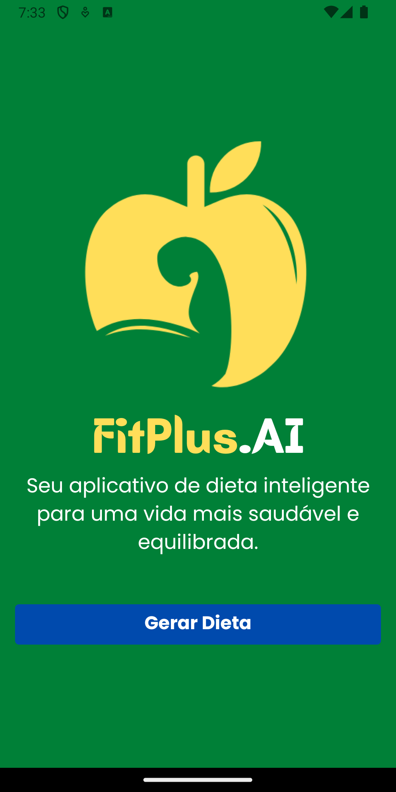
  </div>

  <div style="text-align: center; margin: 10px;">
    <p><b>Tela 2:</b> Entrada de dados (Nome, Peso Atual, Altura, Idade)</p>
    
  </div>

  <div style="text-align: center; margin: 10px;">
    <p><b>Tela 3:</b> Forçando as exceções</p>
    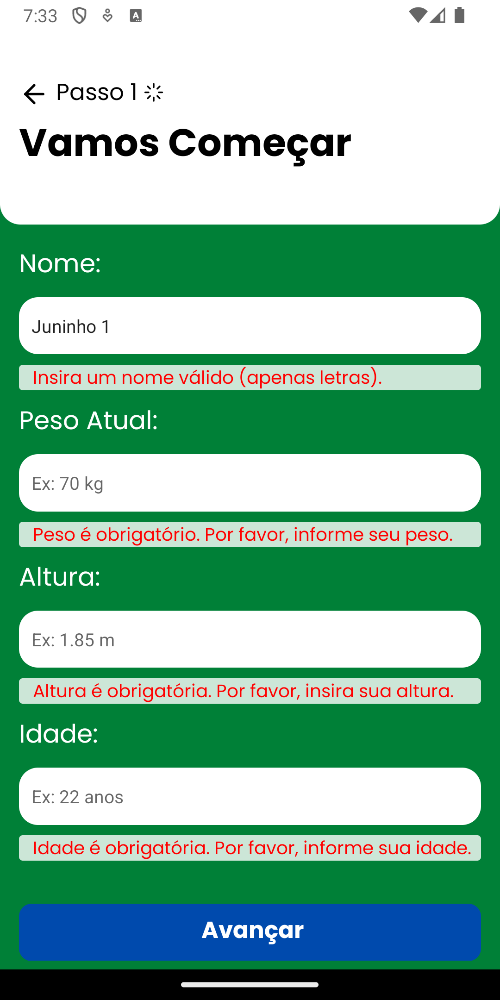
  </div>

  <div style="text-align: center; margin: 10px;">
    <p><b>Tela 4:</b> Forçando outra exceção</p>
    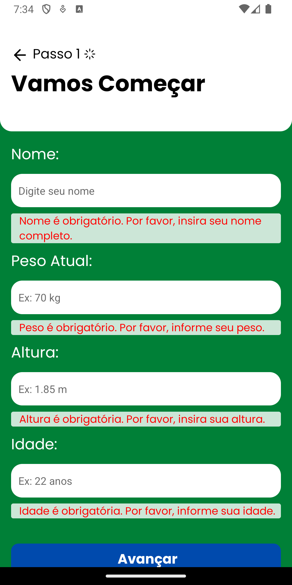
  </div>

  <div style="text-align: center; margin: 10px;">
    <p><b>Tela 5:</b> Informações Inseridas</p>
    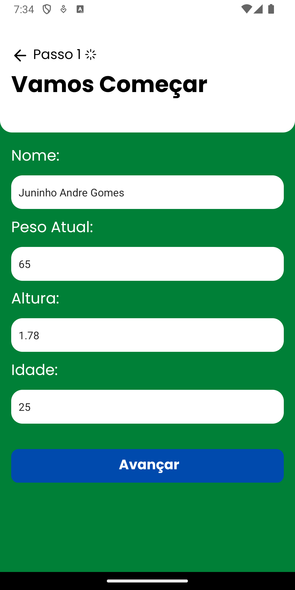
  </div>

  <div style="text-align: center; margin: 10px;">
    <p><b>Tela 6:</b> Entrada de dados (Gênero, Nível Atual, Meta de Treino)</p>
    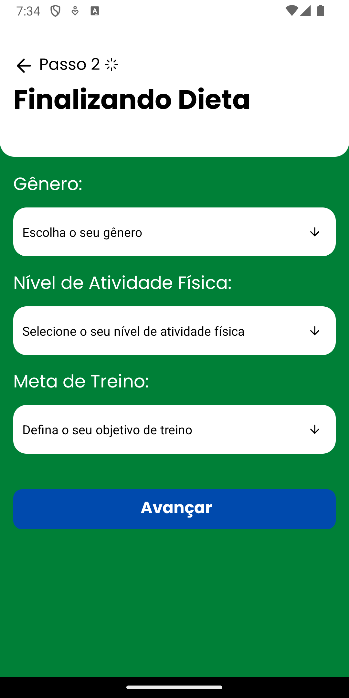
  </div>

  <div style="text-align: center; margin: 10px;">
    <p><b>Tela 7:</b> Opções de Nível de Atividade Física</p>
    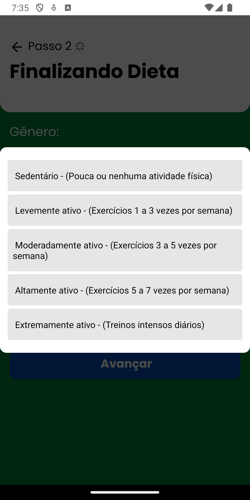
  </div>

  <div style="text-align: center; margin: 10px;">
    <p><b>Tela 8:</b> Opções de Meta de Treino</p>
    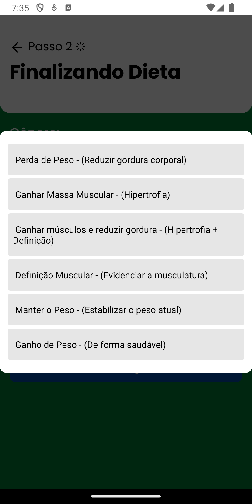
  </div>

  <div style="text-align: center; margin: 10px;">
    <p><b>Tela 9:</b> Tela de Loading 1</p>
    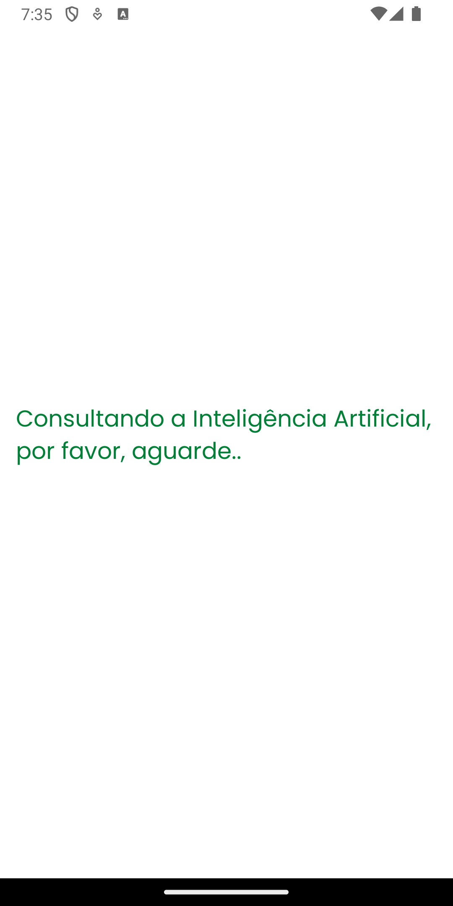
  </div>

  <div style="text-align: center; margin: 10px;">
    <p><b>Tela 10:</b> Tela de Loading 2</p>
    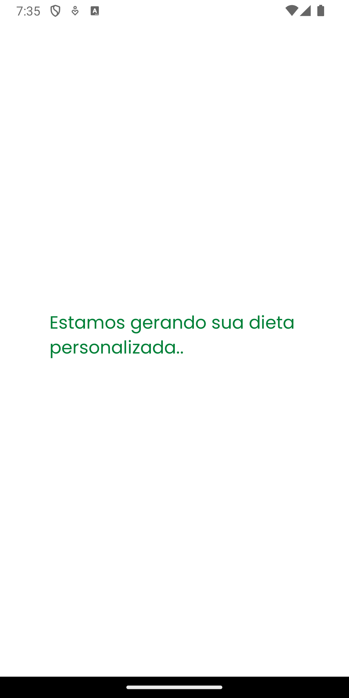
  </div>

  <div style="text-align: center; margin: 10px;">
    <p><b>Tela 11:</b> Tela Exceção - "Sem Conexão com a Internet"</p>
    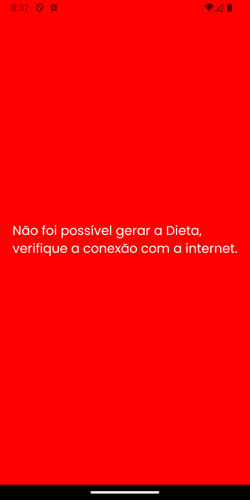
  </div>

  <div style="text-align: center; margin: 10px;">
    <p><b>Tela 12:</b> Tela Exceção 2 - "Erro ao criar a dieta, com opção de retorno à tela principal"</p>
    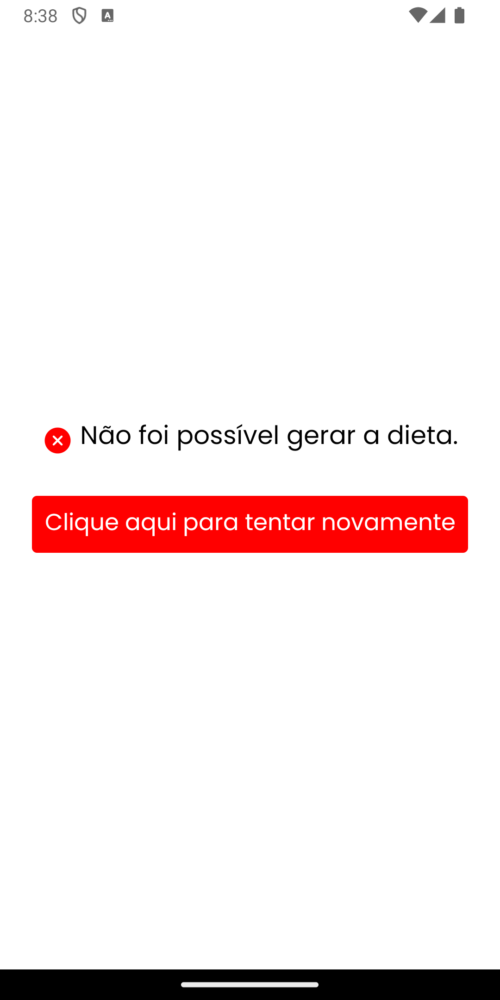
  </div>

  <div style="text-align: center; margin: 10px;">
    <p><b>Tela 13:</b> Dieta Gerada</p>
    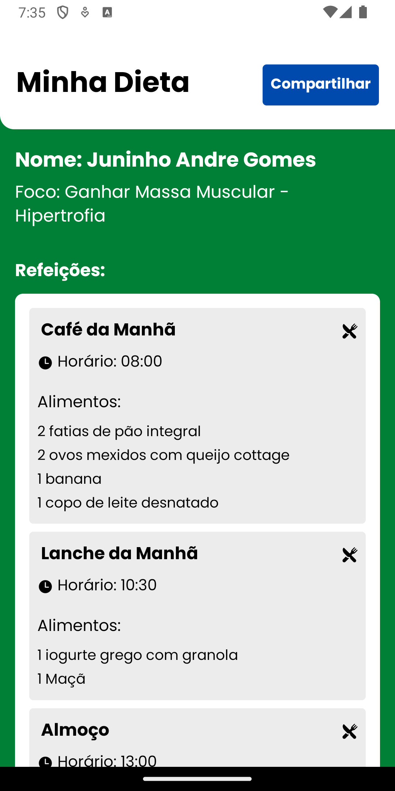
  </div>

  <div style="text-align: center; margin: 10px;">
    <p><b>Tela 14:</b> Opção de "Gerar Nova Dieta"</p>
    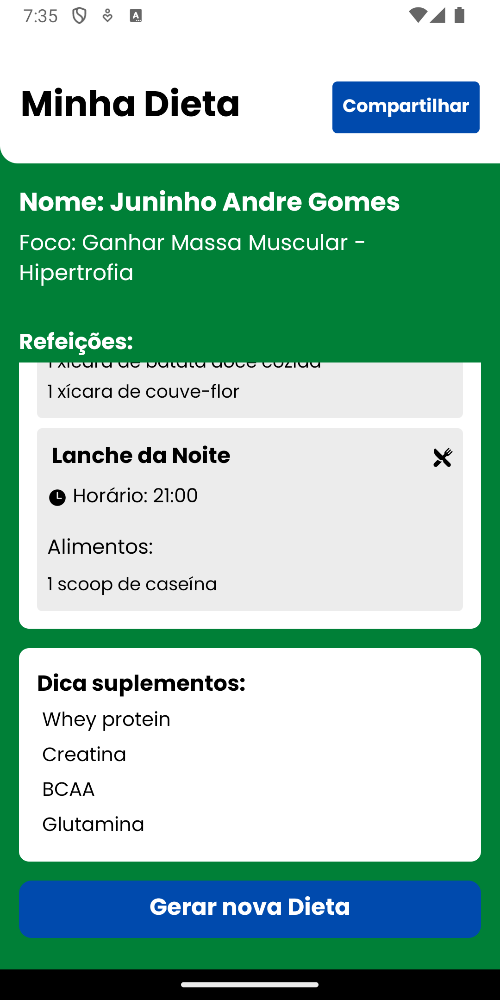
  </div>

  <div style="text-align: center; margin: 10px;">
    <p><b>Tela 15:</b> Opção de Compartilhar Dieta</p>
    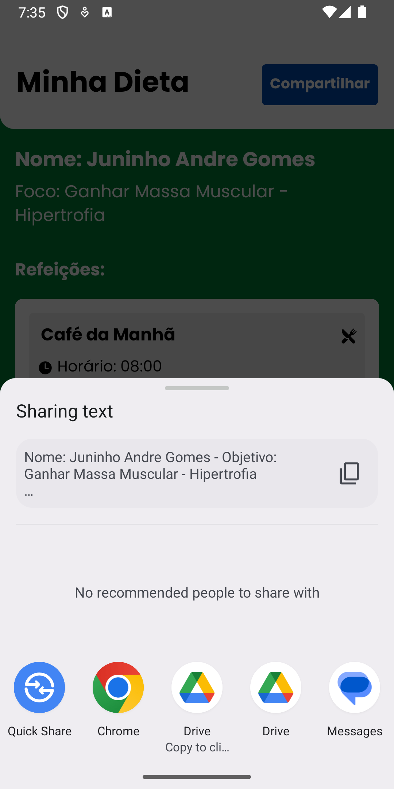
  </div>

</div>
